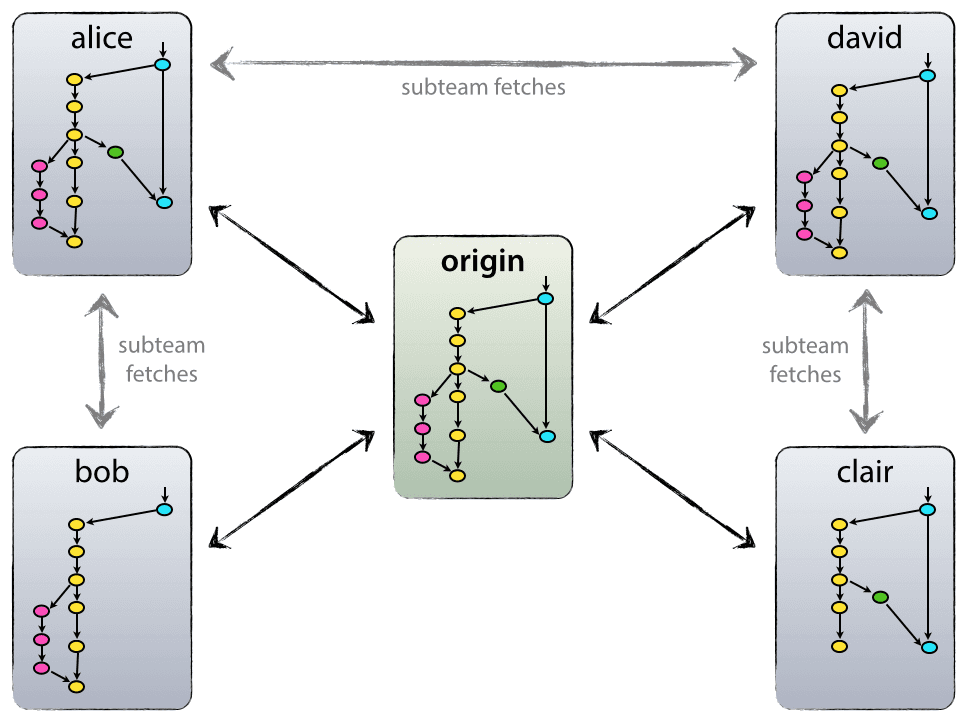

##2015-11-30
+ 更新了主页，基本敲定了主页的主要结构，细节需要更加的琢磨。
+ 添加了“前端学习”栏目的默认页面和两篇新文章，这两篇文章为第一次书写不是很完善，采用的是markdown，但是自己觉得这样没有争取更多的HMLT语句联系，毕竟HTML语义化也是需要多多练习，遂决定第4、5篇文章采用直接书写HTML代替偷懒的markdown，等以后真正熟悉了，可专注于文字，现在还不是时机。

## 2015-12-01
###Todolist
- [ ] 合理化“前端学习”的布局结构，和出入口设置。
- [ ] 关于CSS与HTML文档的结合，CSS选择器和CSS选择其优先级的文章完成。
      - [x] CSS选择器完成。
      - [x] 浮动完成
      - [ ] 定位完成
      - [ ] 主页“关于我”完成
- [ ] :kissing: 个人介绍页面和404页面设计。

##2015年-12-14日
###文章主体规范

为了减少在格式的不必要时间，使用Markdown语言时，总是附带有其他软件的样式，
每次为了这个工具而话费更多时间，不是很值当，所以，花费一点时间建立一个关于
内容主体的模板_default-content-template.html_,并同时为它设定了一个默认的简单样式
后期可以考虑合并到主体CSS中。

## 2015年-12-16日
+ [ ] "位置"文章的完成
+ [x] "浮动"文章的完成
## 2015-12-17
+ [x] "为模板添加了文章主体导航"
+ [x] 整体导航还有很多的细节需要更新，减少了当view大于960px时/*header*过宽的问题
+ [x] 为模板增加了一个主体文章的导航，设计为手机端，为大屏添加特定的基础样式，需要细化。
+ [x] 完善文章主题的样式细节
+ [x] 16号任务“位置”文章的完成
+ [x] “居中大戏”文章的完成
+ [ ] “前端学习”入口需合理化

## 2015-12-28-2016-1-10
+ [x] “居中大戏”完成
+ [x] 主页headder部分更改布局方式，采用flexbox布局

        0. 可用方案：
        1. 传统方案：利用浮动
        2. bootstrap 栅栏布局
        3. **flex布局**
+ [ ] 新增“flex与组件”文章，更进一步联系flex布局（文章为意译）
+ [ ] 前端学习页面增加索引页，修复文章页面的索引导航（大屏幕下）
+ [ ] footer部分增加内容，使页脚丰富
+ [ ] 增加个人简历页面（关于我）
+ [ ] 持续整理DEMO

## 2016-1-5
+ [ ] 修改内容页面导航索引问题（修改对应的CSS文件，媒体查询设置不正确，以BS的媒体规格为参考）
+ [x] “居中大戏”今天必须完成 (1-7)

## 2016-1-15

##2016-1-17

+ 更改原代码高亮方法,采用highlight.js
+ 更新demos,多个demo生成中!
+ 更新flexeplorer中"获取样式的方法",并因此得到副产品"如何获取样式".
+ 更新如何使得代码区随同变化的方法.

## 2016-1-21

学习使用科学规范的开发流程

+ git分支
	+ 永久分支
		+ master branch
		+ develop branch
	+ 临时性分支
		+ feature branch
		+ release branch
		+ hotbug branch
+ 使用规范

master(项目管理者)-->develop(开发分支)-->feature(实际开发分支)

feature-\*(特性开发)-->develop-->删除对应分支-->another feature-\*

	//项目管理者原仓库建立,初始化master,develop分支
	1,本地建立
	~: mkdir git-demo && cd git-demo && git init && git checkout -b develop
	2,推送至github或者git本地服务器
	~: git push origin master
	~: git checkout develop && git push origin develop

	//开发过程 fork to github (github上点击fork)

	//克隆至本地
	~: git clone .git

	//创建个人develop分支,并切换
	~: git check -b develop

	//创建feature-*分支
	~: git check -b feature-*

	//内容更新
	~: touch app.html

	//提交更新至feature0-*分支
	~: git add . && git commit -m "add * feature"

	//切换会develop分支
	~: git checkout develop

	//合并特性分支
	~: git merge feature-*

	//删除特性分支
	~: git branch -d feature-*

	//推送本地develop分支至源develop分支
	~: git push origin develop

	//功能需求开发后,向项目管理提起pull request,github上有个很大绿色按钮

	//管理员操作,看到pull request,这一块没有试验过,要和朋友互相试试看.

这几张图真是有点吓人,是对于初级开发者多练习几次应该会有所得,加油学习, 对于企业中的git管理,商业代码不适合发布到网络,可自建本地服务器,具体参考[廖雪峰博客](http://www.liaoxuefeng.com/wiki/0013739516305929606dd18361248578c67b8067c8c017b000/00137583770360579bc4b458f044ce7afed3df579123eca000).
